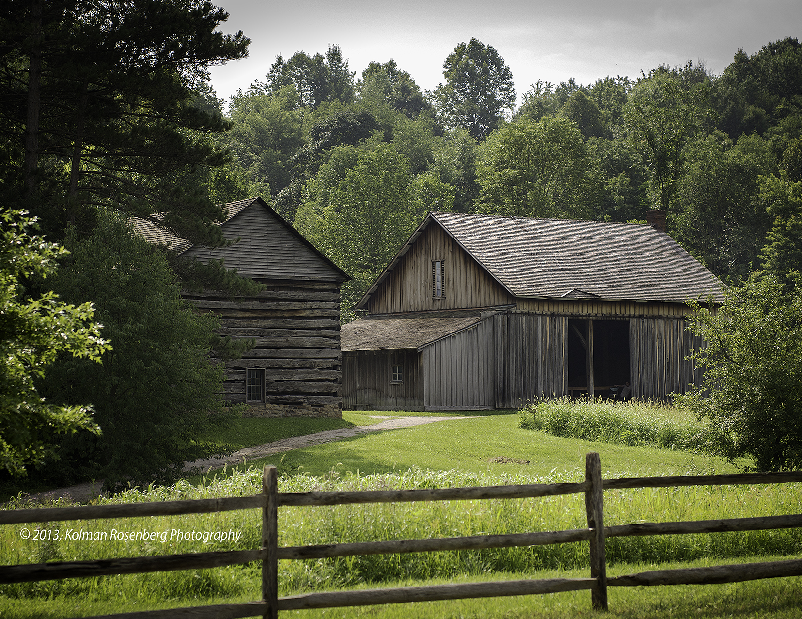

We'll be having both our ceremony and reception at **Hale Farm & Village** in **Bath, Ohio**.

<iframe src="https://www.google.com/maps/embed?pb=!1m18!1m12!1m3!1d3002.2888850218687!2d-81.59458668431215!3d41.193675015943874!2m3!1f0!2f0!3f0!3m2!1i1024!2i768!4f13.1!3m3!1m2!1s0x8830d942511c45ef%3A0xa273c0d0426f8f85!2sHale+Farm+%26+Village!5e0!3m2!1sen!2sus!4v1516818814663" width="600" height="450" frameBorder="0" style="border:0" allowfullscreen></iframe>

The ceremony :ring: will take place outside in the apple :apple: orchard, and we'll have the reception inside at the gatehouse. The two locations are within walking distance of each other.

You can find more out about Hale Farm at the [website](https://www.wrhs.org/plan-your-visit/hale-farm/)

### What?! That's not Cleveland!!

Oh you know us too well. We love Cleveland, and yes, its a bit surprising that we aren't hosting our shindig in the forest city, but Hale Farm is only a 30 minute drive south of Cleveland!

Although we wouldn't trade our city living for anything in the world, we love spending our weekends running :running: and biking :bike: in Cleveland's parks. Hale Farm is located within biking distance of one our favorites, the [Cuyahoga National Park](https://www.nps.gov/cuva/index.htm) and more specifically, [the Ohio & Erie Canal Towpath](https://www.nps.gov/cuva/planyourvisit/ohio-and-erie-canal-towpath-trail.htm).
